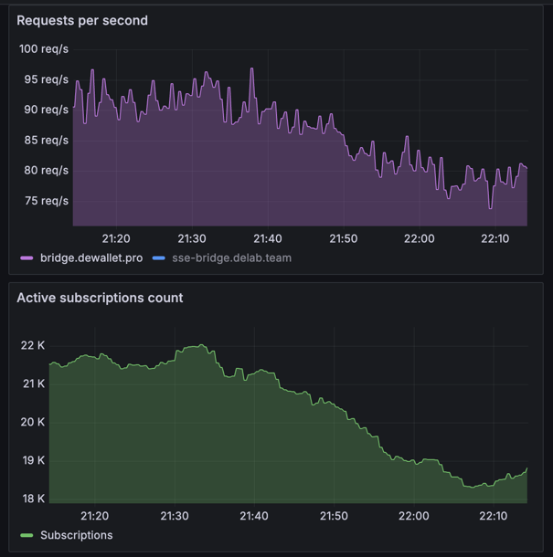

# rs-bridge  

A simple, fast, and secure server-sent events bridge
for [TonConnect](https://docs.ton.org/develop/dapps/ton-connect/protocol/bridge) v2 protocol built with Rust.

Brought to you by [swap.coffee](https://swap.coffee) ☕️ ❤️

⚠️ **Note:** SSE bridge is maintained by the wallet provider. App developers do not have to choose or build a bridge.
Each wallet’s bridge is listed in the [wallets-list](https://github.com/ton-blockchain/wallets-list) config.

## Features

- [x] Fully implements the [TonConnect](https://docs.ton.org/develop/dapps/ton-connect/protocol/bridge) SSE bridge
  protocol specification.
- [x] Written in Rust with speed and safety in mind.
- [x] Optimized for low memory usage and high performance.
- [x] Can handle thousands of concurrent connections
- [x] Supports webhooks for wallet notifications.
- [x] Production-ready and battle-tested on [DeWallet](https://t.me/dewallet) with **1.8M** monthly active users.



## How to run

There is a pre-built Docker image available on [Docker Hub](https://hub.docker.com/r/catcoderr/rs-bridge). You can
easily run it with the following command:

```bash
docker run -d --name rs-bridge -e RUST_LOG=info -p 8080:8080 catcoderr/rs-bridge:latest
```

## Configuration

You can configure the server using environment variables. Here is the list of available options:

| Option                            | Description                                                              | Default Value | Type              |
|-----------------------------------|--------------------------------------------------------------------------|---------------|-------------------|
| **SSE_ENABLE_CORS**               | Enables or disables Cross-Origin Resource Sharing (CORS).                | true          | Boolean           |
| **SSE_MAX_TTL**                   | Maximum Time-To-Live (TTL) for messages received from client in seconds. | 3600          | Integer           |
| **SSE_MAX_CLIENTS_PER_SUBSCRIBE** | Maximum number of clients allowed per subscription.                      | 10            | Integer           |
| **SSE_MAX_PUSHES_PER_SEC**        | Maximum number of pushes allowed per second.                             | 5             | Integer           |
| **SSE_HEARTBEAT_SECONDS**         | Interval in seconds for sending heartbeat messages.                      | 15            | Integer           |
| **SSE_HEARTBEAT_GROUPS**          | Number of heartbeat groups.                                              | 8             | Integer           |
| **SSE_CLIENT_TTL**                | Time-To-Live (TTL) for clients connections without any listeners.        | 300           | Integer           |
| **SSE_WEBHOOK_URL**               | URL for webhook notifications.                                           | None          | String (Optional) |
| **SSE_WEBHOOK_AUTH**              | Authorization token for webhook notifications.                           | None          | String (Optional) |
| **SSE_BRIDGE_PORT**               | Port for the bridge server.                                              | 8080          | Integer           |
| **SSE_METRICS_PORT**              | Port for the Prometheus metrics server.                                  | 8081          | Integer           |

⚠️ **Note:** If you provide authentication token for webhooks, it will be sent as a `Bearer` token in the
`Authorization` header meaning there is not need to prefix it with `Bearer`.

# Metrics

The server exposes Prometheus metrics on the `/metrics` endpoint running on the port specified by the `SSE_METRICS_PORT`
environment variable.

Here is the list of available metrics:

| Metric Name                                | Description                                    | Metric Type   |
|--------------------------------------------|------------------------------------------------|---------------|
| **tonconnect_bridge_active_subscriptions** | Active (connected) subscriptions with clients. | **gauge**     |
| **tonconnect_bridge_requests**             | HTTP Requests.                                 | **histogram** |
| **tonconnect_bridge_delivered_messages**   | Delivered messages.                            | **counter**   |
| **tonconnect_bridge_pushed_messages**      | Pushed messages.                               | **counter**   |
| **tonconnect_bridge_sent_webhooks**        | Sent webhooks.                                 | **counter**   |
| **tonconnect_bridge_failed_webhooks**      | Failed webhooks.                               | **counter**   |

# Libraries used

- [serde_json](https://crates.io/crates/serde_json) - A JSON serialization/deserialization library for Rust.
- [tokio](https://crates.io/crates/tokio) - An asynchronous runtime for Rust.
- [warp](https://crates.io/crates/warp) - A super-easy, composable, web server framework for warp speeds.
- [tokio-stream](https://crates.io/crates/tokio-stream) - A library for working with async streams in Rust.
- [reqwest](https://crates.io/crates/reqwest) - An ergonomic HTTP Client for Rust.